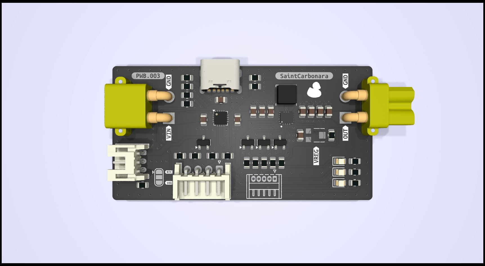

# PWB.003

PCB for powering something from 1S LI-PO or USB.  
Uses PMIC with integrated power mux.

Schematics: [Schematics](plots/PWB.003.pdf)  
Mechanical: [Mechanical](plots/PWB.003__Assembly.pdf)  
BOM: [BOM](production/bom.csv)

## Key features

- Configurable output
- Up to 3.5A input
- 2.5v\<VOUT\<16v
- Battery charging and protection
- low quiescent power consumption (In theory, still not tested)
- OVP, OCP, UVP (as claimed in datasheet for BQ24073RGT)

## Connectors

- 5x1 P1.25 for control communication with MCU
- 1x4 P2.54 for powering directly from BMS and measuring battery voltage
- 1x3 P2.00 for connecting LI-PO
- XT30 for input from battery
- XT30 for output after buck-bust
- USB-C for charging

## Key components

- BQ24073RGT
- TPS63070RNMR

## Test results

TBD

## Photos

## Disclaimer

This hardware design is provided "as is", without warranty of any kind, express or implied, including but not limited to the warranties of merchantability, fitness for a particular purpose, or noninfringement. The authors are not responsible for any damages, losses, or issues caused by the use of this design.

You are responsible for ensuring that the design complies with local regulations, safety standards, and any applicable laws.
